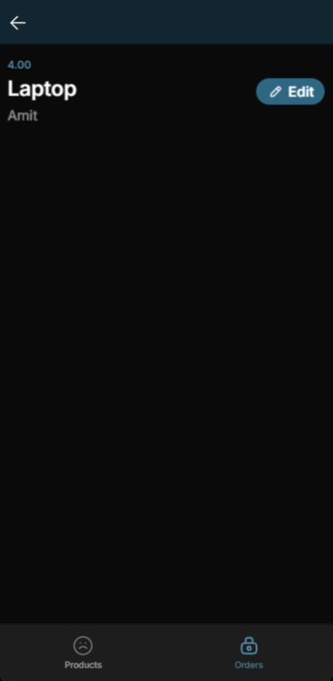

# Marketplace Glide App

A mobile-friendly marketplace application built using **Glide** that enables users to manage products, view orders, and access basic analytics. The app is connected to **Glide Tables** for backend storage and supports dynamic updates for seamless user experience.

## Live Application
Access the deployed app here: [Marketplace App](https://marketplace-t.glide.page)

---

## Screenshots

### Products Tab

### Orders Tab

---

## Features

### 1. **Products Management**
- View a list of products with their names, descriptions, prices, and images.
- Add new products by filling out a form with the following fields:
  - **Product Name**
  - **Description**
  - **Price**
  - **Image**
- Edit or delete existing products.
- Filter products based on logged-in user ownership.

### 2. **Order Management**
- View a segmented list of:
  - **Orders Placed**: Orders made by the logged-in user.
  - **Orders Received**: Orders placed for the logged-in user’s products.
- Detailed view for each order including:
  - Product Name
  - Buyer Name and Email
  - Order Status
  - Quantity
- Add orders directly via custom actions linked to products.

### 3. **Basic Analytics**
- Access a summary of:
  - Total number of products listed by the user.
  - Total orders received.

---

## Technical Implementation

### **Frontend**
- Designed using **Glide’s pre-built components**:
  - **List Layout** for products and orders.
  - **Details View** for individual orders.
  - **Number Components** for analytics.
- Enhanced user interface with icons, colors, and inline lists.

### **Backend**
- **Glide Tables** are used as the backend database.
  - Products Table: Stores product details (name, description, price, image, owner).
  - Orders Table: Stores order details (product name, buyer details, status, quantity).
- Dynamic updates ensure seamless data synchronization across components.

### **Custom Actions**
- Configured "On Submit" actions to:
  - Add products to the Products Table.
  - Automatically add corresponding orders to the Orders Table.

---

## How to Use

1. **Access the App**
   - Open the app link: [Marketplace App](https://marketplace-t.glide.page)

2. **Log In**
   - Use your email to log in and access personalized features.

3. **Manage Products**
   - Navigate to the **Products** tab.
   - View, add, edit, or delete your products.

4. **View and Manage Orders**
   - Navigate to the **Orders** tab.
   - View segmented lists of orders placed and received.

5. **Analytics**
   - Navigate to the **Analytics** tab to see an overview of your marketplace activity.

---

## Project Structure

### Tables
1. **Products Table**
   - Columns: `Name`, `Description`, `Price`, `Image`, `Owner Email`

2. **Orders Table**
   - Columns: `Product ID`, `Buyer Name`, `Buyer Email`, `Quantity`, `Order Status`, `Date`

3. **Users Table**
   - Used for user profile data (e.g., email, name).

---

## Future Enhancements
- Add payment gateway integration.
- Implement advanced analytics such as revenue tracking.
- Enable notifications for order status updates.
- Allow users to upload product videos.

---

### Author
Developed by Vivek Kumar.
